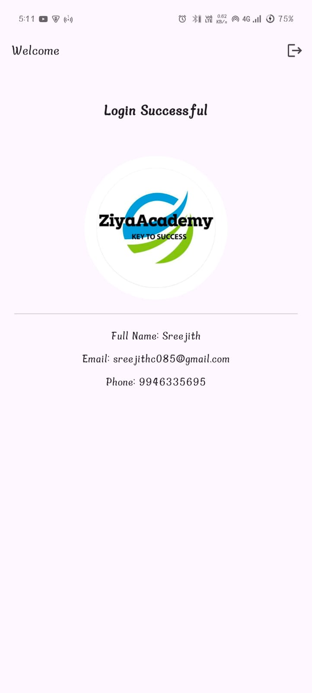

# Flutter + Firebase Authentication Module

This project is a basic user authentication module built using **Flutter** for the frontend and **Firebase** for backend services. It includes **Signup**, **Login**, **Forgot Password**, and **Home** pages with proper validations, error handling, and navigation flow.

---

## 🚀 Features

- ✅ Email/Password Signup and Login
- ✅ Store Full Name & Phone Number in Firestore
- ✅ Forgot Password functionality
- ✅ Input validations & error handling
- ✅ Responsive UI
- ✅ Firebase Email Authentication
- ✅ Navigation using Getx 

---

## 📱 Screens Overview

### 1. **Signup Page**
**Fields:**
- Full Name
- Email
- Phone Number
- Password
- Confirm Password

**Validations:**
- Email must be valid
- Phone Number must be 10 digits
- Passwords must match

**On Success:**
- Create account with Firebase Auth
- Store Full Name & Phone Number in Firestore
- Navigate to Login Page

---

### 2. **Login Page**
**Fields:**
- Email
- Password

**Buttons:**
- Login
- Forgot Password?
- Signup

**Functionality:**
- Validate credentials with Firebase Auth
- Match Phone Number from Firestore
- If matched, navigate to Home Page
- Show alert if incorrect

---

### 3. **Forgot Password Page**
**Fields:**
- Email

**Functionality:**
- Send password reset link using Firebase
- Show confirmation message
- Navigate back to Login Page

---

### 4. **Home Page**
- AppBar: "Welcome"
- Body: "Login Successful"

---

## 🔧 Firebase Configuration

1. Enable **Email/Password** authentication in Firebase Console.
2. Set up **Cloud Firestore** with proper rules.
3. Add your `google-services.json` to the `android/app/` directory.
4. Add your `GoogleService-Info.plist` (for iOS, if applicable).

---

## 🛠️ Dependencies

```yaml
dependencies:
  flutter:
    sdk: flutter
  firebase_core: ^2.0.0
  firebase_auth: ^4.0.0
  cloud_firestore: ^4.0.0
  get: ^4.6.5

---

## 📸 Screenshots

### 🏠 Home Page


### 🔐 Signup Page


### 🔑 Login Page


### 🔒 Forgot Password Page


---